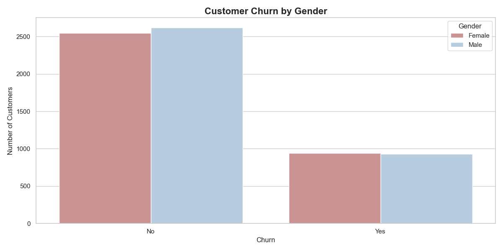
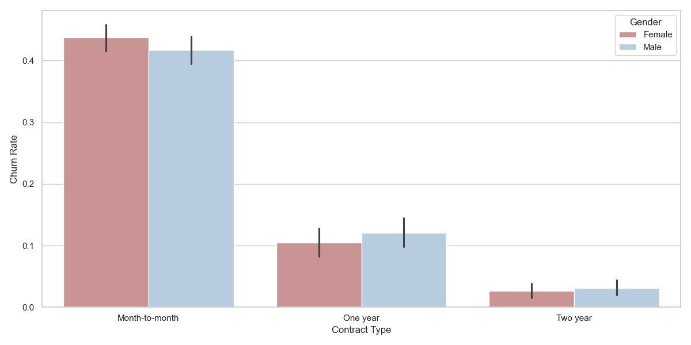
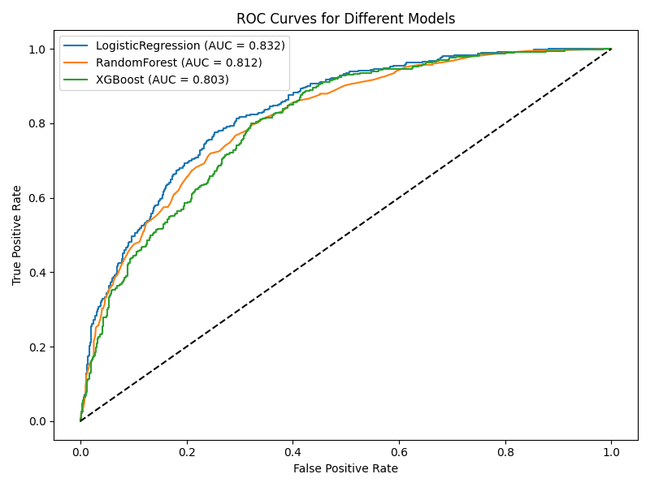
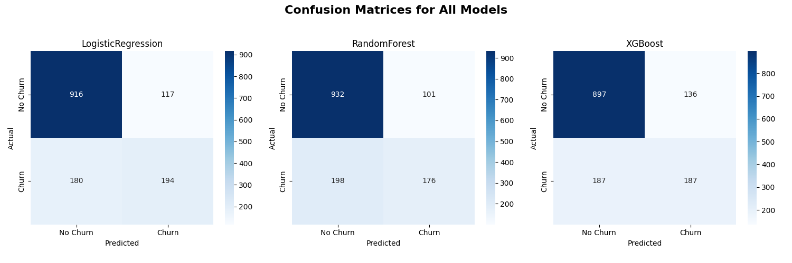

__This project was completed as part of a portfolio for a job application for a Data Scientist.__
__If you are a recruiter, please check out my other projects on GitHub/Kaggle__

__Этот проект был выполнен как часть портфолио для трудоустройства на позицию Data Scientist.__
__Если вы рекрутер — пожалуйста, загляните в другие мои проекты на GitHub/Kaggle__ 

*EN*

# 🔁 Customer Churn Prediction

A project to create machine learning models for customer predictions in telecom companies.

## 🎯 Project Goal

Predict whether a customer will churn (Churn = Yes) or the consequences (Churn = No) based on demographic and behavioral characteristics, including contract type, payment details, availability of internet services, etc.

Task: **binary classification**.

---

## Data

Source: [Kaggle: Telco Customer Churn](https://www.kaggle.com/datasets/blastchar/telco-customer-churn)

Size: 7043 rows × 21 columns
Target variable: `Churn`
Problems solved in data preparation:
- Convert `TotalCharges` from strings to numbers
- Remove rows with empty values
- Encoding categorical features

---

## Technologies used

- **Python**: pandas, numpy, matplotlib, seaborn, sklearn, xgboost
- **Machine learning**:
- Logistic regression
- Random forest
- XGBoost
- **Model evaluation**:
- Accuracy, F1, ROC AUC
- Confusion matrix
- ROC curve
- **ML infrastructure**:
- learn `Pipeline`
- `Transformer column`
- `joblib` for saving models
- `json` for logging metrics

---

## 📊 Preview

### Churn distribution by gender:

### Churn contract duration:

### ROC curves:

### Confusion matrices:

---

## Project Structure

customer-churn-prediction/

├── data/ # source CSV file

├── models/ # saved model and metrics

├── notebooks/

│ └── EDA.ipynb # exploratory data analysis

├── plots/ # plots

├── src/

│ ├── preprocess.py # data preparation

│ └── train.py # model training

├── README.md # this file

└── requirements.txt # list of dependencies

---

## Key Insights

- **Customers with monthly contracts** are much more likely to churn
- **Shorter tenure** correlates with churn
- **Higher monthly payments** → higher chance of churn
- Customer gender has almost no effect on churn probability

---

## Model Results

| Model               | Accuracy | ROC AUC |
|---------------------|----------|---------|
| Logistic Regression | 0.79     | 0.83    |
| Random Forest       | 0.79     | 0.81    |
| XGBoost             | 0.77     | 0.8     |

> Best model: **LogisticRegression with AUC: 0.832**

---

## Artifacts

- `churn_model.pkl` — saved sklearn pipeline
- `metrics.json` — metrics of all models
- `plots/*.png` — plots (EDA + metrics)

---

## How to run

**Install dependencies**
pip install -r requirements.txt

**Train model**
python src/train.py

__________________________________________________________________________________

*RU*

# Customer Churn Prediction

Проект по построению модели машинного обучения для предсказания оттока клиентов в телеком-компании.

## 🎯 Цель проекта

Предсказать, уйдёт ли клиент (Churn = Yes) или останется (Churn = No) на основе демографических и поведенческих признаков, включая тип контракта, платёжные данные, наличие интернет-услуг и т.д.

Задача: **бинарная классификация**.

---

## Данные

Источник: [Kaggle: Telco Customer Churn](https://www.kaggle.com/datasets/blastchar/telco-customer-churn)

Размер: 7043 строк × 21 колонка  
Целевая переменная: `Churn`  
Проблемы, решённые при подготовке данных:
- Преобразование `TotalCharges` из строк в числа
- Удаление строк с пустыми значениями
- Кодирование категориальных признаков

---

## Используемые технологии

- **Python**: pandas, numpy, matplotlib, seaborn, sklearn, xgboost
- **Machine Learning**:
  - Logistic Regression
  - Random Forest
  - XGBoost
- **Оценка модели**:
  - Accuracy, F1, ROC AUC
  - Confusion Matrix
  - ROC-кривая
- **ML-инфраструктура**:
  - sklearn `Pipeline`
  - `ColumnTransformer`
  - `joblib` для сохранения модели
  - `json` для логирования метрик

---

## 📊 Визуализация

### Распределение оттока по полу:

### Влияние контракта на отток:

### ROC-кривые:

### Confusion Matrices:

---

## Структура проекта

customer-churn-prediction/

├── data/ # исходный CSV-файл

├── models/ # сохранённая модель и метрики

├── notebooks/

│ └── EDA.ipynb # исследовательский анализ данных

├── plots/ # графики

├── src/

│ ├── preprocess.py # подготовка данных

│ └── train.py # обучение моделей

├── README.md # этот файл

└── requirements.txt # список зависимостей

---

## Основные инсайты

- **Клиенты с помесячными контрактами** гораздо чаще уходят
- **Меньший срок использования (tenure)** коррелирует с оттоком
- **Более высокие ежемесячные платежи** → выше шанс ухода
- Пол клиента почти не влияет на вероятность оттока

---

## Результаты моделей

| Model               | Accuracy | ROC AUC |
|---------------------|----------|---------|
| Logistic Regression | 0.79     | 0.83    |
| Random Forest       | 0.79     | 0.81    |
| XGBoost             | 0.77     | 0.8     |

> Best model: **LogisticRegression with AUC: 0.832**

---

## Артефакты

- `churn_model.pkl` — сохранённый sklearn pipeline
- `metrics.json` — метрики всех моделей
- `plots/*.png` — графики (EDA + метрики)

---

## Как запустить

**Установить зависимости**
pip install -r requirements.txt

**Обучить модель**
python src/train.py

